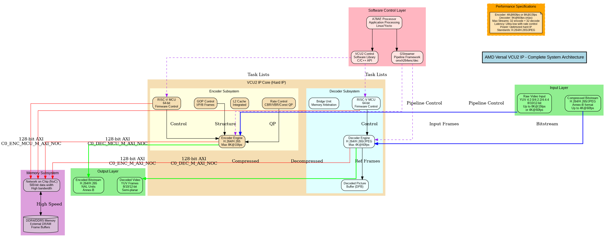
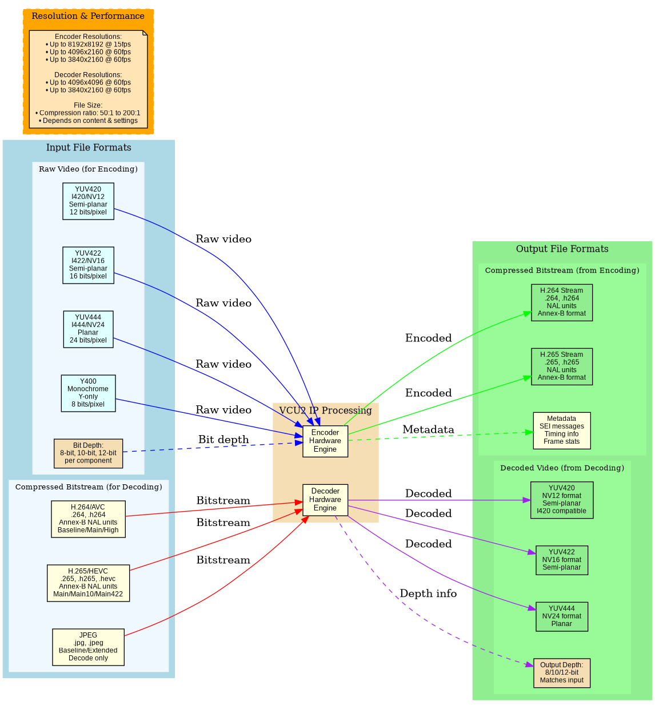
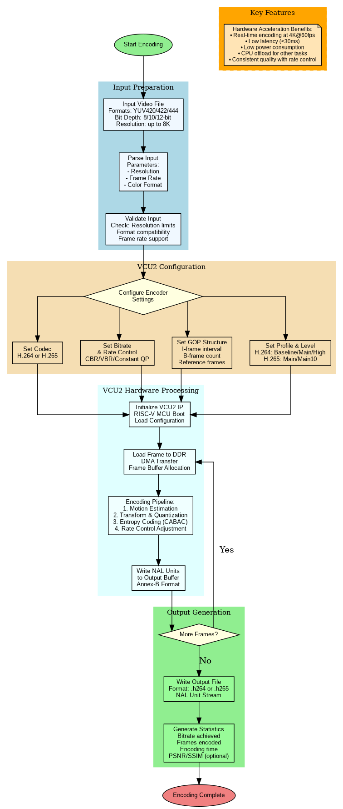
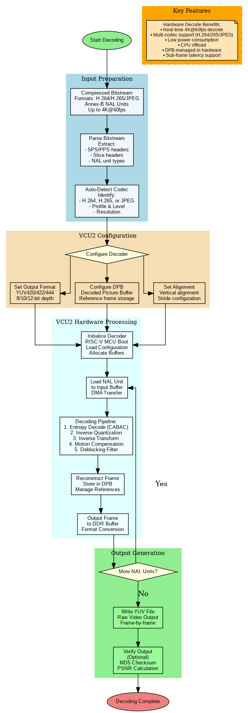
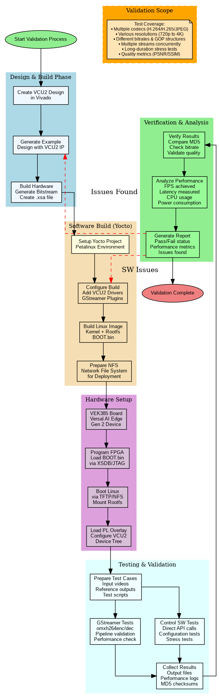

# AMD Versal Video Codec Unit 2 (VCU2) IP - Complete Technical Documentation

## Understanding the VCU2 IP: A Comprehensive Guide

Welcome to this detailed exploration of the AMD Versal Video Codec Unit 2, commonly referred to as VCU2 IP. This document has been created to help you develop a deep and thorough understanding of this sophisticated hardware video processing solution. Whether you are a hardware engineer looking to integrate VCU2 into your design, a software developer working with video applications, or simply someone interested in learning about modern video compression technology, this guide will walk you through everything you need to know about the VCU2 IP, from its fundamental concepts to its most advanced features.

---

## What is the VCU2 IP and Why Does It Matter?

The Video Codec Unit 2 is a specialized hardware block that AMD has integrated directly into their Versal AI Edge Series Gen 2 and Versal Prime Series Gen 2 devices. To understand what makes this significant, we need to first consider what video codecs do and why having them implemented in dedicated hardware rather than software is so important.

When you watch a video on your phone, stream a movie, or participate in a video conference, the raw video data is far too large to transmit or store efficiently. For example, a single second of uncompressed 4K video at 60 frames per second would require approximately 1.5 gigabytes of storage. This is where video compression, or "encoding," becomes essential. Video codecs compress this raw video data into a much smaller size while trying to maintain visual quality as high as possible.

Traditionally, video encoding and decoding have been performed using software running on general-purpose CPUs. While this approach works, it has significant limitations. Software-based encoding is computationally intensive, meaning it consumes a lot of CPU power, generates substantial heat, and drains battery life quickly. It also struggles to achieve real-time performance with high-resolution video, which is increasingly important as we move toward 4K and even 8K content.

This is where the VCU2 IP makes a transformative difference. Instead of asking the CPU to perform millions of complex calculations for every frame of video, the VCU2 provides dedicated hardware that is specifically designed and optimized for video compression and decompression. Think of it like the difference between asking a general contractor to build your house versus hiring specialized craftspeople for each task. The specialized hardware can perform these operations much faster, using dramatically less power, while freeing up the CPU to handle other important tasks in your system.

---

## The Core Architecture: How VCU2 is Organized

To truly understand how VCU2 works, we need to examine its internal architecture. The VCU2 IP is organized into several key subsystems, each with its own specific role in the video processing pipeline.

At the highest level, VCU2 consists of two major processing blocks: the Encoder subsystem and the Decoder subsystem. These can operate independently and even simultaneously, which means you can encode one video stream while decoding another at the same time. This simultaneous operation capability is particularly valuable in applications like video conferencing systems or surveillance equipment that need to both capture and display video concurrently.

### The Encoder Subsystem

The encoder subsystem is responsible for taking raw, uncompressed video frames and converting them into compressed bitstreams that can be stored or transmitted efficiently. At the heart of the encoder is a powerful processing engine that implements the complex algorithms required by the H.264 and H.265 video compression standards. These are the same standards used by Netflix, YouTube, and virtually every modern video platform, so compatibility is excellent.

What makes the encoder particularly interesting is how it's controlled. Rather than requiring constant intervention from the main system CPU, the encoder includes its own dedicated 64-bit RISC-V microcontroller. This microcontroller runs firmware that manages the entire encoding process. You can think of this as having a specialized assistant who takes care of all the detailed work once you've given them the basic instructions. The main CPU simply provides the encoder with a task list describing what needs to be encoded and with what settings, then the RISC-V microcontroller handles all the complex coordination required to actually perform the encoding. This architecture dramatically reduces the burden on the main CPU and improves overall system efficiency.

The encoder also includes an integrated Level 2 cache, which is a small but very fast memory that sits between the encoder engine and the main system memory. This cache helps reduce the number of times the encoder needs to access the slower external memory, which improves both performance and power efficiency. In traditional FPGA designs, you would often need to dedicate precious on-chip BRAM or URAM resources to this purpose, but with VCU2, the cache is built directly into the hard IP, saving these resources for other parts of your design.

### The Decoder Subsystem

The decoder subsystem performs the opposite function from the encoder. It takes compressed video bitstreams in H.264, H.265, or JPEG format and reconstructs them back into raw video frames that can be displayed on a screen or processed further. Like the encoder, the decoder has its own dedicated RISC-V microcontroller that manages the entire decoding process.

One of the critical components in the decoder is something called the Decoded Picture Buffer, usually abbreviated as DPB. To understand why this exists, you need to know a bit about how modern video compression works. Most video frames are not encoded completely independently. Instead, the encoder looks at differences between consecutive frames and only encodes what has changed. This means that to properly decode frame number 50, the decoder might need to reference information from frames 45, 47, and 49. The DPB is where these reference frames are stored. The decoder's bridge unit manages all the complex memory operations required to fetch these reference frames when needed, organize the decoded output, and handle all the memory bandwidth requirements efficiently.

### Memory and Data Movement

Both the encoder and decoder need to move large amounts of data in and out of the system's external memory. A single 4K video frame can be multiple megabytes in size, and when you're processing 60 of these frames every second, you end up with enormous data movement requirements. The VCU2 IP connects to the system's memory infrastructure through something called a Network-on-Chip, or NoC for short. This is essentially a very high-bandwidth internal highway that connects different parts of the Versal device together.

The VCU2 has four separate 128-bit-wide connections to the NoC: one for the encoder's data path, one for the encoder's microcontroller, one for the decoder's data path, and one for the decoder's microcontroller. Having these separate paths prevents the different operations from interfering with each other and helps maintain consistent performance even when both encoding and decoding are happening simultaneously.

---

## Supported Video Standards and Formats

Understanding which video standards and formats VCU2 supports is essential for determining whether it will meet your application's needs. Let me walk you through each of the supported standards and explain what they mean in practical terms.

### H.264/AVC (Advanced Video Coding)

H.264, which is also known as AVC or MPEG-4 Part 10, is one of the most widely used video compression standards in the world today. If you've ever watched a video on YouTube, used Zoom for a video call, or watched a Blu-ray disc, you've almost certainly encountered H.264-encoded video. The VCU2 encoder can create H.264 video streams, and the decoder can play them back.

The H.264 standard actually includes several different "profiles" that represent different sets of encoding features and complexity levels. The simplest is the Baseline profile, which was designed for applications like video conferencing where low latency and low computational complexity are important. The Main profile adds support for more advanced compression features that improve quality at the cost of some additional complexity. The High profile, which is what Blu-ray discs and most high-quality streaming services use, includes even more advanced features for achieving the best possible compression efficiency.

The VCU2 supports all of these profiles, plus several others including High 10 (which supports 10-bit color depth instead of the standard 8-bit), High 4:2:2 (which preserves more color information and is important for professional video production), and High 4:4:4 (which preserves the maximum amount of color information and is used in specialized applications).

When we talk about H.264 "levels," we're referring to the maximum resolution, frame rate, and bitrate that the encoder or decoder can handle. The VCU2 supports levels up to 5.2, which corresponds to 4K UHD resolution at 60 frames per second. There's also partial support for level 6.0, which allows encoding at 8K resolution, although at a reduced frame rate of around 15 frames per second.

### H.265/HEVC (High Efficiency Video Coding)

H.265, also called HEVC or MPEG-H Part 2, is the successor to H.264. The main advantage of H.265 is that it can achieve the same visual quality as H.264 while using approximately half the bitrate. This means you can fit twice as much video in the same storage space, or stream the same quality video over a connection with half the bandwidth. These improvements come from using more sophisticated compression algorithms, though this also means H.265 encoding and decoding are more computationally intensive than H.264.

The VCU2's support for H.265 includes the Main profile (which is the standard profile for consumer applications), Main 10 (which adds 10-bit color depth support), Main 12 (which supports 12-bit color depth for even higher quality), and various 4:2:2 and 4:4:4 profiles for professional applications. The highest level supported is 5.1 High Tier, which corresponds to 4K UHD at 60 frames per second, with partial support for level 6.0 for 8K encoding at reduced frame rates.

One interesting capability of the VCU2's H.265 decoder is support for interlaced video, specifically in what's called Sequence-Adaptive Field-Frame or SAFF format. Interlaced video is an older technology that's still used in broadcast television in some parts of the world. While the encoder doesn't support creating interlaced H.265 video, the decoder can handle it, which is important for systems that need to play back legacy content.

### JPEG (Joint Photographic Experts Group)

JPEG is primarily known as a still image compression format (think of all the .jpg files on your computer), but it's also used in video applications in a couple of interesting ways. First, some video formats store each frame as an independent JPEG image, creating what's called Motion JPEG or MJPEG. Second, in advanced video codecs like H.264 and H.265, I-frames (the periodically inserted frames that can be decoded independently without reference to other frames) are essentially encoded using JPEG-like techniques.

The VCU2's JPEG support is decode-only, meaning it can decompress JPEG images and MJPEG video streams, but it cannot create new JPEG-compressed images. This is actually quite practical because JPEG encoding can be efficiently handled in software, but JPEG decoding can benefit from hardware acceleration, especially at higher resolutions. The decoder supports both the Baseline JPEG profile and the 12-bit Extension, and it can handle various chroma subsampling formats including 4:2:0, 4:2:2, and 4:4:4. The maximum resolution for JPEG decoding is 4096 × 4096 pixels.

---

## Understanding Input and Output File Formats

One of the most practical questions when working with video processing hardware is: what formats can I give it, and what formats will it give back to me? Let me walk you through this in detail.

### Input Formats for Encoding

When you want to encode video with the VCU2, you start with raw, uncompressed video. This raw video is typically stored in what's called YUV format. To understand YUV, you need to know that it's a different way of representing color information compared to the RGB format you might be more familiar with.

In RGB format, each pixel's color is described by three values: how much red, how much green, and how much blue. In YUV format, each pixel is instead described by a luminance value (Y, which represents brightness) and two chrominance values (U and V, which together represent the color or hue). The reason YUV is preferred for video is that the human visual system is more sensitive to changes in brightness than to changes in color, so we can often use less data for the color components without noticeably degrading the image. This property makes YUV formats more amenable to efficient compression.

The VCU2 encoder accepts several YUV variants. The YUV420 format (specifically I420 or NV12 variations) uses half the horizontal and half the vertical resolution for the color components compared to the brightness component. This reduces the overall data size by a factor of two compared to full-resolution color, but most people can't see the difference in typical viewing conditions. YUV422 uses full vertical resolution but half horizontal resolution for color, preserving more color detail in the horizontal dimension (which is often more perceptually important). YUV444 uses full resolution for all components, providing the maximum color fidelity, which is important in professional video production. There's also a Y400 format, which is monochrome video with no color information at all, sometimes used in security cameras or scientific imaging.

Each of these formats can be used with different bit depths. Eight-bit depth provides 256 possible values for each component and is what most consumer video uses. Ten-bit depth provides 1,024 possible values per component and is increasingly common in high-end consumer equipment and professional applications because it can represent smoother color gradations and a wider range of brightnesses and colors. Twelve-bit depth takes this even further with 4,096 possible values and is mainly used in cinema and high-end professional production.

### Input Formats for Decoding

When you're decoding video, your input is a compressed bitstream. For H.264 and H.265, this bitstream is organized into something called NAL units (Network Abstraction Layer units) in what's known as Annex-B format. Each NAL unit is a self-contained packet of encoded data representing part of the compressed video. Some NAL units contain parameter sets that describe how the video is encoded, while others contain the actual compressed picture data.

For JPEG decoding, the input follows the standard JPEG file format as defined in the ISO/IEC 10918-1 specification. This is the same format that regular JPEG image files use.

### Output Formats from Encoding

When the VCU2 encoder compresses your video, it produces a bitstream file in either H.264 or H.265 format. These output files contain NAL units in Annex-B format, which is the most common and widely compatible way to structure these bitstreams. The files typically have extensions like .h264, .264, .h265, or .265, though the extension doesn't fundamentally matter since it's just a label.

The encoder can also insert metadata into the compressed bitstream through something called Supplemental Enhancement Information or SEI messages. These messages can carry timing information, color space details, content descriptions, and other supplementary data that might be useful to players or processing software downstream. The encoder can also provide frame-level statistics through its software interface, which can include information like how many bits were used to encode each frame, what quality level was achieved, and timing information about when frames were processed.

### Output Formats from Decoding

When the VCU2 decoder decompresses video, it produces raw YUV frames in the same formats that the encoder accepts as input. The most common output format is YUV420 in the NV12 variant, which is a semi-planar format where the Y component is stored in one continuous block of memory and the U and V components are interleaved in a second block. This format is particularly efficient for hardware processing and is widely supported by display subsystems and other video processing blocks.

The bit depth of the decoded output will match the bit depth of the original encoded video. If you encoded with 10-bit input, you'll get 10-bit output when you decode.

---

## The Encoding Process: A Detailed Walkthrough

To help you understand exactly how the VCU2 processes video for encoding, let me walk you through the entire process step by step.

The process begins when you have a raw video file that you want to compress. Your first task is to parse this file to understand its characteristics. You need to determine the video's resolution (perhaps 1920×1080 for Full HD or 3840×2160 for 4K UHD), its frame rate (such as 30, 60, or 120 frames per second), and its color format (YUV420, YUV422, etc.). You also need to verify that these parameters fall within the VCU2's supported range. For encoding, resolutions up to 8K (8192×8192 pixels) are supported, though at 8K resolution the frame rate will be limited to around 15 frames per second. At 4K resolution, you can encode at the full 60 frames per second.

Once you've validated your input, you need to configure the encoder with all the parameters that will control how the compression is performed. The first major decision is which codec to use. Will you encode in H.264 for maximum compatibility with older devices and players, or will you use H.265 for better compression efficiency and smaller file sizes? H.265 can achieve the same quality at roughly half the bitrate of H.264, but it requires more computational power to decode and isn't supported by some older hardware.

Next, you configure the bitrate and rate control mode. The bitrate determines how many bits of data are used per second of video. Higher bitrates preserve more detail and quality but result in larger files. The VCU2 supports three rate control modes. Constant Bitrate (CBR) mode tries to maintain a steady, predictable bitrate throughout the video, which is important for streaming applications where you need consistent network bandwidth usage. Variable Bitrate (VBR) mode allows the bitrate to fluctuate based on scene complexity, using more bits for complex scenes with lots of detail and motion, and fewer bits for simple, static scenes. This generally provides better overall quality for a given average bitrate. Constant QP mode uses a fixed quantization parameter, which determines how aggressively the encoder compresses the data. This mode is often used when you want predictable quality rather than predictable file size.

The GOP (Group of Pictures) structure is another critical configuration parameter. The GOP defines the pattern of frame types in your encoded video. I-frames (Intra frames) are completely self-contained and can be decoded independently, like individual JPEG images. P-frames (Predicted frames) are encoded by reference to previous frames, storing only what has changed. B-frames (Bidirectional frames) can reference both past and future frames for even better compression efficiency. The GOP structure determines how often I-frames appear and how many B-frames are used. A typical setting might be an I-frame every 60 frames (once every 2 seconds at 30 fps) with 2 B-frames between each P-frame.

You also need to select the appropriate profile and level for your target application. If you're encoding for the widest possible compatibility, you might choose H.264 Baseline profile. For higher quality consumer applications, H.264 High profile or H.265 Main profile would be appropriate. For professional applications requiring high color fidelity, you might use H.265 Main 4:2:2 10-bit profile.

With all these parameters configured, you initialize the VCU2 encoder. The RISC-V microcontroller boots up, loads your configuration, and prepares the encoder engine. Your application then begins feeding raw video frames into the encoder. Each frame is loaded into DDR memory where the VCU2 can access it. The encoder's built-in DMA (Direct Memory Access) controllers handle the transfer of this data without involving the main CPU.

Now the actual encoding happens. The encoder analyzes each frame, performing motion estimation to identify which parts of the frame are similar to previous frames. The transform and quantization stage converts the image data into frequency domain information and compresses it by discarding less perceptible details. The entropy encoding stage (using sophisticated algorithms like CABAC - Context-Adaptive Binary Arithmetic Coding) further compresses this information into the final bitstream. Throughout this process, the rate control logic adjusts the quantization parameters frame by frame to achieve the target bitrate you specified.

The compressed NAL units are written to an output buffer in memory. Your application retrieves these NAL units and writes them to a file. This process repeats for each frame in your video. When all frames have been encoded, the encoder generates final statistics showing you what bitrate was achieved, how long the encoding took, and other performance metrics.

---

## The Decoding Process: From Bitstream to Video

The decoding process essentially reverses the encoding, taking a compressed bitstream and reconstructing the original video frames. Let me guide you through this process.

Decoding begins with a compressed bitstream file in H.264, H.265, or JPEG format. The first step is to parse this bitstream to extract header information. The decoder needs to read the SPS (Sequence Parameter Set) and PPS (Picture Parameter Set) in H.264/H.265 streams to understand how the video was encoded. These parameter sets describe the resolution, profile, level, and various encoding tools that were used. From this information, the decoder can automatically determine what kind of video it's dealing with.

Based on the information extracted from the headers, you configure the decoder. You specify what output format you want. While the input was compressed H.265, you might want the output in YUV420 NV12 format for display. You configure the Decoded Picture Buffer size based on the number of reference frames the encoded stream uses. You might also configure vertical alignment and stride parameters to match the requirements of downstream processing blocks like display engines or video scalers.

After initialization, the decoder's RISC-V microcontroller starts processing the bitstream. Each NAL unit is loaded into the input buffer. The decoder's entropy decoding stage reverse the CABAC or CAVLC encoding, extracting the quantized transform coefficients. The inverse quantization and inverse transform stages convert these coefficients back into pixel domain information. The motion compensation stage uses the motion vectors embedded in the bitstream to predict portions of the current frame based on previously decoded reference frames stored in the DPB. The reconstructed frame is then put through post-processing filters. The deblocking filter smooths out block artifacts that can appear at the boundaries between 16×16 or 8×8 blocks. In H.265, there's an additional Sample Adaptive Offset filter that further improves quality.

The decoded frame is stored in the DPB for potential use as a reference in decoding future frames. It's also output to memory in your specified output format. Your application retrieves these decoded frames and can then display them, save them to a file, or process them further.

The process continues for each NAL unit in the input bitstream until the entire video has been decoded. Throughout the process, the decoder manages the complex dependencies between frames, ensuring that reference frames are available when needed and that frames are output in the correct display order (which can differ from the decoding order when B-frames are used).

---

## Validation and Testing: Ensuring VCU2 Works Correctly

Understanding how to properly validate and test the VCU2 IP is crucial for any production deployment. Let me walk you through the complete validation process that was used to verify the VCU2's functionality.

The validation process begins long before you have hardware to test. It starts in the Vivado design tool where you create a complete system design that includes the VCU2 IP. AMD provides example designs that show how to properly instantiate the VCU2 and connect it to the rest of the Versal device's infrastructure. These example designs include all the necessary connections to the NoC, proper clock configurations, and interface definitions. From this design, Vivado generates what's called an XSA file (Xilinx Support Archive), which is essentially a complete description of the hardware configuration that software will need to run on the device.

While the hardware design is being created, there's a parallel effort to build the software stack. This uses the Yocto Project, which is a sophisticated build system for creating custom Linux distributions for embedded devices. Yocto takes thousands of software components - the Linux kernel itself, device drivers, system libraries, applications, and utilities - and builds them all together into a cohesive system image tailored specifically for your hardware.

For VCU2, the Yocto build needs to include several critical components. The VCU2 device drivers need to be compiled into the Linux kernel so the operating system can communicate with the hardware. The VCU2 Control Software library provides the high-level API that applications use to control the encoder and decoder. GStreamer, which is a popular multimedia framework, needs plugins that know how to use the VCU2 hardware. All of this software is built against the hardware description in your XSA file, ensuring that addresses, interrupt numbers, and other hardware-specific details are correct.

When both the hardware bitstream and software image are ready, they're deployed to actual hardware, in this case the VEK385 evaluation board. This board contains a Versal AI Edge Gen 2 device that includes the VCU2 hard IP. The deployment process involves programming the FPGA portion of the Versal device with your hardware design and booting Linux from a network file system (NFS) to make software development and testing more flexible.

The actual testing uses two complementary approaches. The GStreamer approach uses pre-built multimedia pipelines. For encoding, you might run a command like: `gst-launch-1.0 filesrc location=input.yuv ! rawvideoparse ! omxh264enc ! filesink location=output.h264`. This tells GStreamer to read a raw YUV file, use the VCU2 hardware encoder (through the omxh264enc plugin), and write the compressed output. For decoding, the pipeline might look like: `gst-launch-1.0 filesrc location=input.h264 ! h264parse ! omxh265dec ! filesink location=output.yuv`. These pipelines exercise the complete encode/decode chain while measuring frame rates, checking for dropped frames, and verifying that the output quality is acceptable.

The Control Software approach uses direct API calls to the VCU2 library, giving you more fine-grained control over encoder and decoder parameters. This is useful for testing specific features or configurations that might not be easily accessible through GStreamer. The test scripts provide reference bitstreams with known properties and compare the decoder's output against reference outputs using MD5 checksums to verify bit-exact correctness.

The validation process tests a wide matrix of configurations. Different resolutions are tested from 720p up to 4K and 8K. Various bitrates are tried to ensure rate control works correctly across the full range. Different GOP structures are validated. Both codecs (H.264 and H.265) are tested. Multiple streams are encoded or decoded simultaneously to verify the IP can handle the claimed throughput. Long-duration tests run for hours or days to check for memory leaks, stability issues, or performance degradation over time.

Performance metrics are carefully measured and documented. The actual achieved frame rate is recorded and compared against the specifications. Latency is measured from the time a frame enters the encoder until the compressed output is available, or from bitstream input to decoded output in the decoder. CPU usage is monitored to verify that the hardware acceleration is effective. Power consumption is measured to ensure the IP meets efficiency targets. All these results are compiled into a validation report that documents what was tested, what passed, and what issues (if any) were found.

---

## Performance Specifications

| Specification Category | Parameter | Value | Notes |
|------------------------|-----------|-------|-------|
| **Encoder Performance** | Maximum Resolution | 8192 × 8192 | Limited to approximately 15 fps at this resolution |
| | 4K UHD Performance | 3840 × 2160 @ 60 fps | Full frame rate |
| | 4K DCI Performance | 4096 × 2160 @ 60 fps | Requires 950 MHz core clock |
| | Supported Codecs | H.264, H.265 | No JPEG encoding |
| | Maximum Concurrent Streams | 32 | Aggregate bandwidth limited to 4K@60fps equivalent |
| **Decoder Performance** | Maximum Resolution | 4096 × 4096 @ 60 fps | No 8K decode support |
| | 4K UHD Performance | 3840 × 2160 @ 60 fps | Full frame rate |
| | 4K DCI Performance | 4096 × 2160 @ 60 fps | Requires 918 MHz core clock |
| | Supported Codecs | H.264, H.265, JPEG | JPEG up to 4096×4096 |
| | Maximum Concurrent Streams | 32 | Aggregate bandwidth limited |
| **Memory Interface** | Data Path Width | 128-bit | Per channel |
| | Number of AXI Interfaces | 4 independent | 2 for encoder, 2 for decoder |
| | Supported Memory | DDR4, DDR5 | Via NoC |
| **Video Format Support** | Chroma Formats | 4:2:0, 4:2:2, 4:4:4, 4:0:0 | Semi-planar and planar |
| | Bit Depths | 8-bit, 10-bit, 12-bit | Per color component |
| | Progressive/Interlaced | Progressive (both), SAFF Interlaced (H.265 decode only) | |
| **Control** | Microcontrollers | 2× RISC-V 64-bit | One per encoder, one per decoder |
| | Firmware | Pre-loaded, non-modifiable | Handles all encoding/decoding control |
| **Rate Control** | Modes | CBR, VBR, Constant QP | |
| | Latency | Ultra-low with frame-level control | Suitable for real-time applications |

Understanding these specifications requires some context. The encoder's ability to handle 8K resolution at 15 fps is quite remarkable, but you should understand that this is primarily useful for creating high-resolution content that will be played back on powerful systems. Real-time encoding for live streaming would typically use 4K or lower resolutions at higher frame rates. The requirement for specific clock frequencies at 4K DCI resolution shows the performance optimization that's been built into the IP, automatically scaling its operating frequency based on the workload.

The fact that encoding and decoding can happen simultaneously, with up to 32 streams each, doesn't mean you can necessarily run 64 streams at full 4K@60fps. The aggregate bandwidth limitation means that if you're encoding one stream at 4K@60fps, that's using your full bandwidth budget, but you could instead encode multiple lower-resolution streams, or encode some streams at 4K@30fps, etc. The system will handle the bandwidth allocation automatically, but you need to plan your stream configurations to stay within the aggregate limit.

---

## Real-World Applications

The VCU2 IP has been designed to serve a diverse range of real-world applications. Understanding these use cases can help you determine whether VCU2 is appropriate for your specific needs and how to best configure it for optimal performance.

In video security and surveillance systems, VCU2 enables efficient multi-camera encoding. A typical surveillance system might have dozens of cameras, each producing a continuous video stream that needs to be compressed for storage and/or transmission to a central monitoring station. Using VCU2, you can encode multiple camera streams simultaneously in real-time, choosing H.265 to minimize storage requirements while maintaining the image quality needed to identify important details. The low-latency capabilities ensure that security personnel see events as they happen, not with significant delays. The power efficiency of hardware encoding means the system can run continuously without excessive heat generation or energy costs.

Broadcast and professional AV systems use VCU2 for its high-quality encoding capabilities and support for professional formats. A live broadcast production might use the encoder to create multiple versions of a program simultaneously at different bitrates for adaptive streaming, or to create both a high-quality archival master and a lower-bitrate distribution version. The decoder's ability to handle 4:2:2 and 4:4:4 chroma formats with 10 or 12-bit color depth makes it suitable for professional post-production workflows where color accuracy is critical.

Multimedia streaming applications benefit from VCU2's real-time encoding capabilities and adaptive bitrate support. A streaming server might use VCU2 to transcode incoming video into multiple quality levels, allowing viewers with different network bandwidths to each receive an appropriate version of the content. The hardware acceleration means the server can handle more concurrent streams than would be possible with software encoding, improving cost efficiency.

Embedded vision applications in industrial automation, medical imaging, or autonomous vehicles use VCU2 to compress the vast amounts of video data these systems generate. An autonomous vehicle might use cameras for perception and navigation, generating multiple high-resolution video streams that need to be compressed for recording or transmission to remote operators. The low latency is critical in these safety-critical applications.

Video conferencing and collaboration systems leverage VCU2's simultaneous encode and decode capabilities along with its low latency. A conferencing endpoint encodes the local camera feed while simultaneously decoding feeds from remote participants. The low latency ensures natural, real-time conversation without the awkward delays that make remote meetings frustrating.

Medical and scientific imaging applications benefit from the support for high bit depths (10 and 12-bit) and lossless or near-lossless compression modes. Medical images often need to preserve subtle details that might be lost with aggressive compression, and the ability to use higher bit depths can be important for capturing the full dynamic range of specialized imaging sensors.

---

## Comparing VCU2 to Software-Based Encoding

To fully appreciate what VCU2 offers, it's helpful to understand how it compares to traditional software-based video encoding and decoding. This comparison will help you understand when hardware acceleration like VCU2 makes sense and when software approaches might be sufficient.

When you encode video using software, the CPU performs all the computational work required by the compression algorithms. Modern video codecs like H.264 and especially H.265 are extremely complex, involving motion estimation, transform calculations, quantization, entropy coding, and numerous other operations for each macroblock of each frame. For a 4K video at 60 fps, this means the CPU must process 3840 × 2160 = 8,294,400 pixels, sixty times per second, applying complex algorithms to groups of these pixels. This translates to an enormous computational workload.

The most immediate difference you'll notice is performance. Software encoding on a typical multi-core CPU might struggle to achieve real-time encoding of 4K video at 60 fps even when using all available cores. It might take several times longer than real-time, meaning that encoding one hour of video could take three or four hours of processing time. With VCU2, that same 4K@60fps encoding happens in real-time or faster, with the hardware keeping pace with the incoming video frames. This difference becomes even more dramatic when you need to handle multiple streams simultaneously. Software encoding of four simultaneous streams would essentially bring a CPU to its knees, but VCU2 can handle it comfortably while the CPU remains available for other tasks.

Power consumption tells a similar story. When a CPU is working hard to encode video, it's consuming significant power and generating substantial heat. This heat must be managed with cooling systems, which adds to both power consumption and system cost. In battery-powered devices, intensive CPU usage drains the battery rapidly. The VCU2 hardware accelerator, by contrast, performs the same video processing tasks while consuming a small fraction of the power. The dedicated hardware is optimized for these specific operations, achieving much better performance per watt than general-purpose CPU cores.

From a system architecture perspective, the difference is substantial. With software encoding, the CPU is busy handling video compression and has less capacity for other important tasks like user interface responsiveness, data processing, network communication, or running other applications. This can lead to a sluggish system that struggles to keep up with user demands. With VCU2, the video processing is offloaded to dedicated hardware, freeing the CPU to handle these other tasks smoothly. This is similar to how having a dedicated graphics processor (GPU) for rendering graphics leaves the CPU available for other work.

Quality and consistency also differ between the approaches. Software encoders have enormous flexibility, they can implement any algorithm and can be updated easily. However, their performance can vary dramatically based on system load, whether other applications are consuming CPU resources, thermal throttling if the system gets hot, and many other factors. VCU2 provides consistent, predictable performance. You configure it for 4K@60fps, and it reliably delivers that performance frame after frame, hour after hour.

Cost-effectiveness depends on your application. For occasional video encoding, using software on existing CPU resources has essentially zero hardware cost. But for applications requiring continuous video processing, multiple simultaneous streams, or real-time performance, the efficiency of dedicated hardware like VCU2 can justify its cost through reduced system power consumption, the ability to use less expensive CPUs, and improved system responsiveness.

---

## Getting Started: From Design to Deployment

If you're ready to start using VCU2 in your own project, let me guide you through the process from initial design to final deployment. This section assumes you have access to a Versal AI Edge or Prime Gen 2 device and are familiar with AMD's Vivado design tools.

Your first step is to create a hardware design in Vivado that includes the VCU2 IP. AMD provides comprehensive example designs that demonstrate proper VCU2 integration, and I strongly recommend starting with one of these rather than building from scratch. These examples show correct clock configurations, proper connections between the VCU2's AXI interfaces and the NoC, and appropriate configuration of supporting infrastructure like interrupt controllers and timers.

When you instantiate the VCU2 IP in your design, you'll see various configuration options in the IP customization window. Most of these can typically be left at their default values for initial testing. The primary decisions you need to make involve whether you'll be using the encoder, the decoder, or both, and how you want to configure clocking. The VCU2 requires specific clock frequencies for optimal performance, higher frequencies for higher resolution and frame rate combinations. The example designs include appropriate clock generation and management infrastructure.

After configuring the IP, you'll generate the complete hardware design, run synthesis and implementation, and create a bitstream. For software development, you also need to export the hardware design as an XSA file, which packages up all the information software tools will need about your hardware configuration.

On the software side, you'll use the Yocto Project (or AMD's PetaLinux, which is built on top of Yocto) to build a Linux system for your device. The build process starts by configuring which software packages you want to include. For VCU2, you must include the VCU2 device drivers, the Control Software library, and ideally the GStreamer multimedia framework with its VCU2 plugins. These components are all provided by AMD and can be enabled through the Yocto configuration system.

The Yocto build process takes considerable time on first run (potentially several hours, depending on your build machine's performance) because it's downloading source code, compiling a cross-compilation toolchain, building the Linux kernel, compiling hundreds of software packages, and assembling everything into a coherent system image. Be patient, future builds will be much faster as Yocto caches intermediate results.

When the build completes, you'll have several key files: a boot image (BOOT.bin) that includes the FPGA bitstream and first-stage bootloaders, a Linux kernel image, and a root filesystem image. For development, it's often convenient to boot the kernel and load the root filesystem over the network using TFTP and NFS respectively, as this makes it very easy to update software without having to reprogram flash memory each time.

Connecting to your target hardware, you'll use JTAG to load the boot image, then interact with the system through its UART serial port. The boot process should show the FPGA being configured with your bitstream, the ARM processors starting, and Linux booting. If you've configured networking correctly, the system will mount its root filesystem from your development machine and present you with a login prompt.

With Linux running, you can start testing the VCU2. The simplest tests use GStreamer pipelines. For a basic encoding test, you would copy a raw YUV video file to the system (either over the network or on a USB drive), then run a GStreamer pipeline like this: `gst-launch-1.0 filesrc location=test.yuv ! rawvideoparse width=1920 height=1080 format=i420 framerate=30/1 ! omxh264enc ! filesink location=encoded.h264`. This tells GStreamer to read your YUV file, parse it as 1920×1080 I420 format at 30 fps, encode it using the VCU2 hardware encoder, and write the output to a file. If this works correctly, you'll see progress messages showing frames being encoded, and you'll end up with a compressed H.264 file.

Decoding works similarly: `gst-launch-1.0 filesrc location=encoded.h264 ! h264parse ! omxh264dec ! filesink location=decoded.yuv`. This reads the H.264 file, parses it to identify frame boundaries and codec parameters, decodes it using VCU2 hardware, and writes the raw output frames.

For more advanced usage, you might use the Control Software API directly, which gives you finer-grained control over encoding and decoding parameters. This requires writing C or C++ code that calls the API functions, but it allows you to adjust parameters like bitrate or GOP structure dynamically during encoding, or to retrieve detailed statistics about the encoding/decoding process.

As you develop your application, you'll likely iterate between software development on your development machine and testing on the target hardware. The network boot setup makes this iteration quick since you can modify software on your development machine and it immediately becomes available to the target when you run your modified programs.

For production deployment, you would move away from network booting to a standalone configuration where all necessary files are programmed into the device's flash memory. This requires creating appropriate boot scripts and filesystem images suitable for your specific boot media, whether that's SD card, QSPI flash, or some other storage.

---

## Advanced Topics and Future Directions

As you become more comfortable with the VCU2 IP, there are several advanced topics that become relevant for optimizing performance and enabling sophisticated applications.

Low latency operation is a specialized mode where the encoder is configured to minimize the delay between receiving a raw frame and producing compressed output. This is crucial for live streaming, video conferencing, and other real-time interactive applications. Achieving low latency involves choosing appropriate GOP structures (using more frequent I-frames reduces latency but decreases compression efficiency), enabling slice-level output (which allows transmission of compressed data before the entire frame is encoded), and carefully tuning rate control parameters. The VCU2's hardware acceleration is particularly beneficial here because software encoding's variable and often unpredictable performance makes achieving consistent low latency very difficult.

Multi-stream processing allows you to encode or decode multiple video streams simultaneously. This is common in surveillance systems (many cameras), video conferencing (many participants), or streaming servers (many viewers at different quality levels). The VCU2 can handle up to 32 encoding streams and 32 decoding streams concurrently, though the aggregate bandwidth limitation means you can't necessarily run all streams at maximum resolution and frame rate simultaneously. Effective multi-stream applications require careful planning of stream priorities, bandwidth allocation, and resource management to ensure smooth operation without dropped frames or quality degradation.

Quality optimization involves balancing encoding speed, bitrate, and output quality to achieve the best results for your specific application. The VCU2 provides numerous tuning parameters that affect this balance. Understanding metrics like PSNR (Peak Signal-to-Noise Ratio) and SSIM (Structural Similarity Index Metric) helps you objectively evaluate quality. Different content types (like fast action sports versus talking-head interviews) benefit from different encoder settings, and learning to tune these settings for your specific content can significantly improve results.

Custom application development might involve creating your own multimedia processing pipelines that use VCU2 alongside other processing blocks. For instance, you might have a computer vision application that processes camera input with AI inference accelerators, then uses VCU2 to compress the results for storage or transmission. Or you might build a transcoding system that converts between different video formats and resolutions using VCU2's simultaneous encode/decode capabilities. The Control Software API provides the foundation for building these custom applications.

Looking toward the future, there are several directions where VCU2-based applications might evolve. Integration with AI and machine learning workflows is increasingly common, using AI for content analysis or enhancement while VCU2 handles the compression. Support for emerging video standards and formats continues to evolve. Cloud and edge computing applications might use VCU2 in distributed video processing systems. As video resolutions continue to increase toward 8K and beyond, the role of efficient hardware acceleration will only become more critical.

---

## Summary and Key Takeaways

The AMD Versal VCU2 IP represents a sophisticated approach to video compression and decompression, integrating dedicated hardware acceleration directly into the Versal adaptive SoC platform. Throughout this documentation, we've explored how VCU2 achieves real-time processing of high-resolution video through specialized encoder and decoder engines, each controlled by their own RISC-V microcontrollers and supported by comprehensive software stacks including drivers, libraries, and GStreamer plugins.

The key strengths of VCU2 include its ability to handle multiple video compression standards (H.264, H.265, and JPEG), support for resolutions up to 8K for encoding and 4K for decoding, simultaneous encoding and decoding operations, and the flexibility to handle up to 32 streams concurrently while staying within aggregate bandwidth limits. The hard IP implementation provides predictable performance and power consumption characteristics that are difficult to achieve with software-based approaches.

For engineers and developers working with VCU2, understanding the complete workflow from hardware design through software development to validation and deployment is essential. The integration of proper clock configurations, memory interfaces, and software stacks requires attention to detail but is well-supported by AMD's example designs and documentation. The validation process demonstrates the importance of comprehensive testing across the full range of supported configurations and formats.

As you move forward with VCU2 in your projects, remember that this documentation has provided you with a foundation of understanding. Practical experience with the hardware and software, along with experimentation with different configurations and use cases, will deepen your expertise and help you optimize VCU2's capabilities for your specific applications.

---

## Additional Resources

For further information about the VCU2 IP and Versal devices, please consult the following resources:

- PG447 Product Guide: H.264/H.265/JPEG Video Codec Unit 2 (VCU2) Solutions
- Versal AI Edge Series Gen 2 Data Sheet (DS1021)
- Versal Prime Series Gen 2 Data Sheet (DS1020)
- Vivado Design Suite User Guide (UG973)
- Yocto Project Documentation
- GStreamer Documentation and Tutorials
- AMD Xilinx Support Community and Forums

---

*This documentation is based on VCU2 IP v3.0 and reflects the capabilities and specifications as of November 2025. Always consult the latest official AMD documentation for the most current information.*
